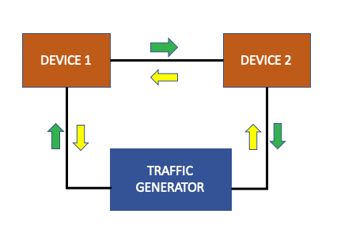

Overview
========

What is a Traffic Generator?
----------------------------

A traffic generator is a device that pumps traffic into a network for
consumption by other devices such as routers and switches.

Why do we need Traffic Generators?
----------------------------------

During typical network validation, routers and switches are normally tested using
traffic generators to simulate 'traffic' flowing through a network. This helps
users validate router performance metrics in scale and stress scenarios.

The ``genie.trafficgen`` package provides functionality to agnostically interact
with commercially available traffic generator devices and perform a multitude of
operations on them. 

The ``genie.trafficgen`` package builds on the functionality provided by third
party vendor software APIs to create a simplistic user exeprience to automate
operations on traffic generator devices.
